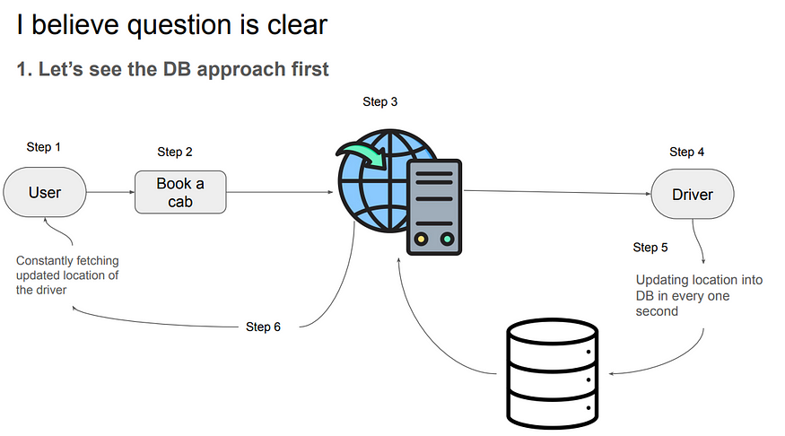
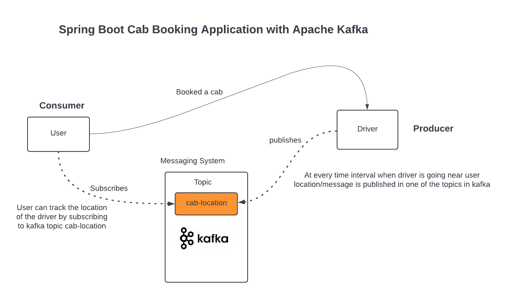

## Spring Boot Cab Booking with Kafka Streaming

### DB Approach

After seeing the diagram everything seems fine and neat
Alright, let’s put our detective hats on and snoop out the problem in this!

1. Now there is only one user and one driver, but their can be million of them.
2. Every second drivers are pushing their location into DB and every second users are picking the location from the DB → So DB will not allow these humongous Operation So System will crash….

### Using Apache kafka
Kafka is an open-source distributed event streaming platform used for building real-time data pipelines and streaming applications.

Kafka is designed to handle large volumes of data, allowing seamless communication between systems and applications in real-time.

It is characterized by its

1. Scalability
2. Fault-tolerance
3. high throughput

Making it a popular choice for organizations across various industries to manage and process streaming data efficiently. Kafka is often used for use cases such as log aggregation, real-time analytics, monitoring, and messaging systems.

